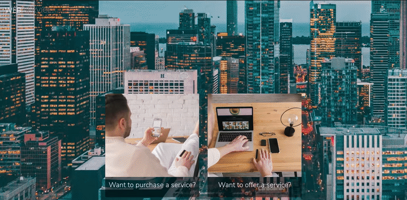
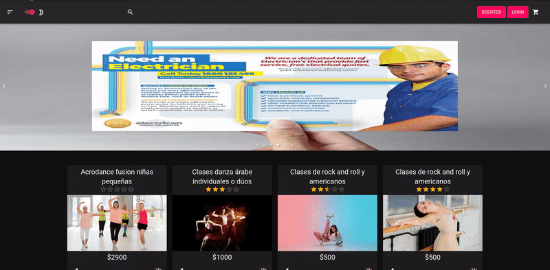

# Web Service


## Descripción

Este es el proyecto final realizado durante la etapa de Labs de <strong>Henry</strong>. El mismo consiste en un E-Commerce, donde se pueden ofrecer o adquirir servicios. El proyecto se llevo a cabo junto a un equipo de a 8 integrantes. Algunas de las caracteristicas principales del proyecto: Metodos de pago, Chat Online/Offline, Panel de Usuario, Filtrados, Panel de Admin.

## Integrantes

- <a href="https://github.com/claudioCMW"></a> <a href="https://www.linkedin.com/in/claudio-wusinowski-2884641a3/"></a> Claudio Miguel Wusinowski
- <a href="https://github.com/Facupelli"></a> <a href="https://www.linkedin.com/in/facundo-pellicer-full-stack-developer/"></a> Facundo Pellicer
- <a href="https://github.com/Fedex159"></a> <a href="https://www.linkedin.com/in/federico-avelin-dev/"></a> Federico Avelin
- <a href="https://github.com/Franco1312"></a> <a href="https://www.linkedin.com/in/franco-kail-219259215/"></a> Franco Kail
- <a href="https://github.com/jonatansegovia"></a> <a href="https://www.linkedin.com/in/jonatan-segovia-dev/"></a> Jonatan Segovia
- <a href="https://github.com/wikonarider"></a> <a href="https://www.linkedin.com/in/micaela-montero-295141217/"></a> Micaela Montero
- <a href="https://github.com/stobar93"></a> <a href="https://www.linkedin.com/in/sebastiantobar-fullstack-dev/"></a> Sebastian Tobar
- <a href="https://github.com/valentinjara27"></a> <a href="https://www.linkedin.com/in/valentin-jara-fullstackdeveloper/"></a> Valentin Jara

## Dependencias utilizadas

- Express 4.17.1
- Node 12.21
- NPM 7.20.3
- React 17.0.1
- Redux 4.1.1

Y muchas más dependencias, consultar los package.json de la ruta <a href="https://github.com/Fedex159/pf-web-service/blob/main/api/package.json">/api</a> y <a href="https://github.com/Fedex159/pf-web-service/blob/main/client/package.json">/client</a>.

## Instrucciones para utilizar el proyecto

- Clonar o forkear el repositorio

### Configurando la DB

Crear un archivo <strong>.env</strong> en la carpeta <strong>/api</strong> con los sigs parámetros:

```bash
DB_NAME = "nombre base de datos"
DB_USER = "usuario de postgres"
DB_PASSWORD = "contraseña de postgres"
DB_HOST = "localhost"
ENV_VARIABLE = "1(valor del force de sequelize, 1 === true o 0 === false)"
ORIGIN = "http://localhost:3000"
SUCCESS_MERCADOPAGO = "http://localhost:3001"
SECRET_KEY = "key para encriptar el token, puede ser cualquier string"
```

Una vez creado y configurado el <strong>.env</strong>, hacer npm install parado en el directorio <strong>/api</strong>.

Para ejecutar el servidor, utilizar <strong>npm start</strong> (solo node), o <strong>npm run start:dev</strong> (con nodemon).

### Configurando el front

Para el front no se requiere de configuraciones adicionales. Parado en la carpeta <strong>/client</strong>, realizar <strong>npm install</strong>.

Para poner en linea el servidor del front, utilizar <strong>npm start</strong> (la primera vez puede tardar un rato).

## Presentación y funcionalidades

### Landing


Landing page, se muestra el logo de la aplicacion, cuenta con animaciones, 2 cards principales, una lleva al Home de la web, el otro te lleva a un formulario de registro y acceso al Login en la parte superior derecha.

### Register



Formulario de registro. Se puede registrar de manera clasica, o utilizando los datos de google para rellenar el formulario.

### Login


Formulario de login. Se puede loguear utilizando las credenciales clasicas, o utilizando las credenciales de google, si la cuenta registrada fue creada con un mail de google valido.

### Home


Pantalla principal de la web. Se puede acceder al panel de filtros en el borde superior izquierdo, carrito en el borde superior derecho, tambien se puede registrar y loguear desde el home. Cuenta con una search bar, un carrousel con los servicios destacados y las cards con informacion principal de cada servicio ofrecido.

### Filtros


Barra de filtros. Se puede hacer varios filtros combinados, ya sea elegir mas de una sub-categoria, filtrar por Provincia, Ciudad, por rango de precio u ordenar por Rating/Precio/Fecha, en forma Descendente o Ascendente.

### Darkmode



Funcionalidad de darkmode. Se puede seleccionar entre activar o desactivar el darkmode. La seleccion se aplica a toda la web y se almacena la seleccion en localStorage.
